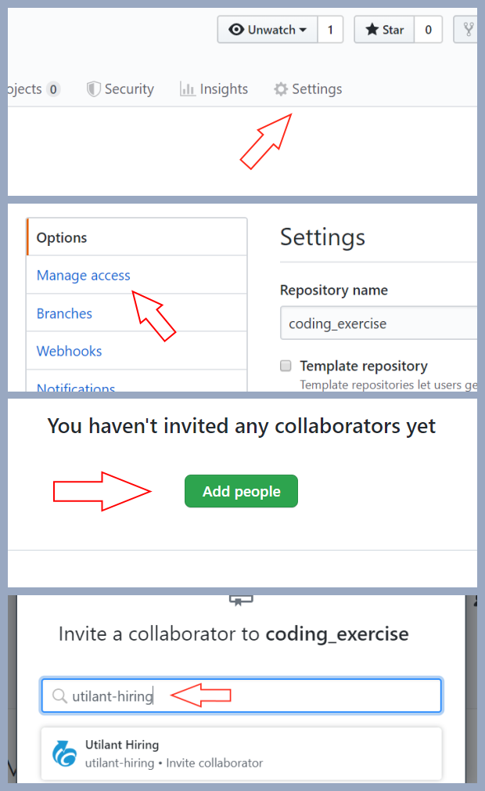

# Utilant Coding Exercise

## Introduction

Thank you for you interest in joining the Utilant team. To help us better understand your level of expertise, we request that all candidates perform a coding exercise. Your work will be reviewed by our team, and may be a basis for further technical discussion during the interview process.

There are two questions in this coding exercise. We request that you please limit yourself to **no more than 2 hours** for this exercise. If you find yourself approaching the 2 hour limit, wrap up your work by documenting what you've done, use pseudo-code to describe other code you'd like to implement, and submit the assignment, even if incomplete.

## Starting the Exercise

For our currently open role of Data Scientist, we prefer candidates use `python3` if possible, but are prepared to accept well-documented solutions in any language you choose. Whichever you choose, please specify the precise version of the language, as well as that of any dependendies or packages imported.

### Step 0: Have a GitHub.com account

If you don't already have a GitHub.com account, please create one. A free account will suffice for your needs for this exercise.

### Step 1: Import this repo to your GitHub account

We'd like you to have a private copy of this repo in your account. To do that, "import" this repo into your account by providing its URL at the following link: [https://github.com/new/import](https://github.com/new/import). The screenshot below demonstrates that the correct URL has been entered, and the copy will be set to "Private."

(Note: do not "fork" this repo, since GitHub will not allow you to make your fork private.)

When the repo has been fully imported to your account, you should receive an email from GitHub.com

### Step 2: Share your private copy of the repo with `utilant-hiring`

Since your import of this repo is private, we'll need you to share access to it with us. This can be done through "Settings" > "Manage access" > "Add people" for your copy of this repo. The screenshots below show the steps you need to take.

### Step 3: You're Ready to Code

In folders within this repo, you'll find the exercises we're asking you to work on. Commit your submission code to the `master` branch of your repo.

Before finishing, be sure to include:
* Language(s) used (including version numbers)
* Additional package(s) or libraries used
* Your name and email address used when applying for the position

## Submitting Your Work

When your submission is ready, email us at `utilant.hiring@gmail.com` with a link to your repo. We'll get back to you as soon as possible.

Thanks, and good luck!
